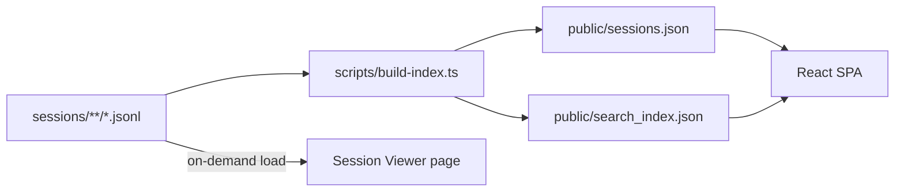

# Codex Session Explorer -- Implementation Plan

## Context

- 260 JSONL session files in `sessions/` organized as `YYYY/MM/DD/rollout-*.jsonl`
- Each file starts with a `session_meta` event (line 1) containing `id`, `timestamp`, `cwd`, `model_provider`, `cli_version`, `git` info
- The first `event_msg` with `payload.type === "user_message"` is the user's initial request (typically line 7)
- Files can be 700KB+, so the index builder must **stream** line-by-line and stop after extracting what it needs
- Stack: React + Vite + TailwindCSS v4 + shadcn/ui, with a Node.js/TypeScript index builder script

## Data Flow




## Actual JSONL Event Schema (from real data)

Key event types in each JSONL file:

- `session_meta` -- line 1, contains: `payload.id`, `payload.timestamp`, `payload.cwd`, `payload.model_provider`, `payload.cli_version`, `payload.git.branch`, `payload.git.repository_url`
- `event_msg` with `payload.type === "user_message"` -- the user's prompt in `payload.message`
- `response_item` -- assistant/developer/user content messages
- `turn_context` -- model, effort, collaboration mode
- `event_msg` with `payload.type === "agent_reasoning"` -- agent thinking
- `event_msg` with `payload.type === "token_count"` -- rate limit info

## Phase 1 -- Foundation

### 1. Scaffold Project

Initialize the project structure at the workspace root:

```
codex-session-explorer/
  scripts/
    build-index.ts          # streaming JSONL parser (sessions.json + search_index.json)
  src/
    pages/
      SessionExplorer.tsx
      SessionViewer.tsx
    components/
      SessionCard.tsx
      SearchBar.tsx
      FilterBar.tsx
      EventTimeline.tsx
    lib/
      search.ts             # MiniSearch wrapper
      types.ts              # shared TypeScript types
  public/
    sessions.json
    search_index.json
  package.json
  tsconfig.json
  vite.config.ts
```

Dependencies: `react`, `react-dom`, `react-router-dom`, `minisearch`, `react-window`, `vite`, `tailwindcss` v4, `shadcn/ui`, `tsx` (for running scripts)

### 2. Define Types

File: `src/lib/types.ts`

TypeScript interfaces for:

- Raw JSONL events: `SessionMetaEvent`, `EventMsg`, `ResponseItem`, `TurnContext`
- Index output: `SessionEntry` (id, title, project, cwd, model, cli_version, git_branch, git_repo, created_at, file, file_size_bytes)
- Search index: `SearchEntry` (session_id, text)

### 3. Build Index Builder

File: `scripts/build-index.ts`

Single script that produces both `sessions.json` and `search_index.json` in one streaming pass per file:

1. Open a **read stream** using `readline` on each JSONL file
2. Parse the first line (`session_meta`) to extract metadata
3. Continue scanning until the first `event_msg` with `payload.type === "user_message"` -- extract `payload.message` as the session title
4. Collect all `user_message` texts encountered so far for the search index
5. **Close the stream** after the first user message -- do not read the rest of the file
6. Get file size via `fs.stat` (no need to count lines)

Output `public/sessions.json`:

```json
[{
  "id": "019cc119-e2a4-7e91-8641-b8baf45a9539",
  "title": "generate docker compose file",
  "project": "codex-sessions-manager",
  "cwd": "/opt/codex-sessions-manager",
  "model": "openai",
  "cli_version": "0.98.0",
  "git_branch": "pr-1",
  "git_repo": "https://github.com/coramba/codex-sessions-manager.git",
  "created_at": "2026-03-06T03:03:45.060Z",
  "file": "sessions/2026/03/06/rollout-...jsonl",
  "file_size_bytes": 739166
}]
```

Output `public/search_index.json`:

```json
[{ "session_id": "019cc119...", "text": "generate docker compose file" }]
```

### 4. Run Indexer

Execute `npx tsx scripts/build-index.ts` against the `sessions/` directory tree. Verify both JSON outputs are valid and contain 260 entries.

---

## Phase 2 -- Basic UI

### 5. SessionExplorer Page

`src/pages/SessionExplorer.tsx`

- On mount, fetch `sessions.json` (~50-100KB for 260 sessions)
- Render a responsive grid of `SessionCard` components
- Filter bar: project dropdown (derived from `cwd` basename), date range picker
- Sort controls: by created_at, file_size

### 6. SessionCard Component

`src/components/SessionCard.tsx`

- Displays: title (first user message), project name, date, model provider, git branch
- Click navigates to `/session/:id` (Session Viewer)

### 7. Search Integration

- Fetch `search_index.json` and initialize MiniSearch on mount
- `SearchBar` component with instant results (<5ms)
- Matching session IDs filter the displayed grid

---

## Phase 3 -- Session Viewer

### 8. SessionViewer Page

`src/pages/SessionViewer.tsx`

- Fetches the raw JSONL file **on demand** only when the user opens a session
- Parses all lines and passes events to `EventTimeline`
- Shows session metadata header (project, model, git branch, duration)

### 9. EventTimeline Component

`src/components/EventTimeline.tsx`

- Event types rendered with role-based styling:
  - `user_message` -- accent-colored bubble
  - `response_item` (assistant) -- neutral bubble with markdown rendering
  - `event_msg` (agent_reasoning) -- collapsible thinking block
  - Tool calls / patches -- code block styling
- Virtualized list (`react-window`) for sessions with hundreds of events
- Syntax highlighting for code blocks (shiki or prism)
- Optional "Replay" mode: events appear one-by-one with delays

---

## Phase 4 -- UX Polish

### 10. Styling and Dark Mode

- shadcn/ui components: Button, Card, Input, Select, DatePicker, Dialog
- TailwindCSS v4 for layout
- Responsive mobile-first grid
- Dark/light mode toggle
- Intentional color palette -- not default purple/white

### 11. Dev Tooling

- `package.json` scripts:
  - `npm run build-index` -- runs the streaming JSONL indexer
  - `npm run dev` -- starts Vite dev server
  - `npm run build` -- production build
- Vite config: configure proxy/static serving for `sessions/` JSONL files
- Optional: Docker Compose for easy deployment

## Performance Budget

- Initial load: fetch `sessions.json` (~~100KB) + `search_index.json` (~~200KB)
- No JSONL parsing at startup
- Session detail: fetch single JSONL file on demand
- Virtual scrolling for both session list and event timeline
- Search latency: <5ms via MiniSearch

